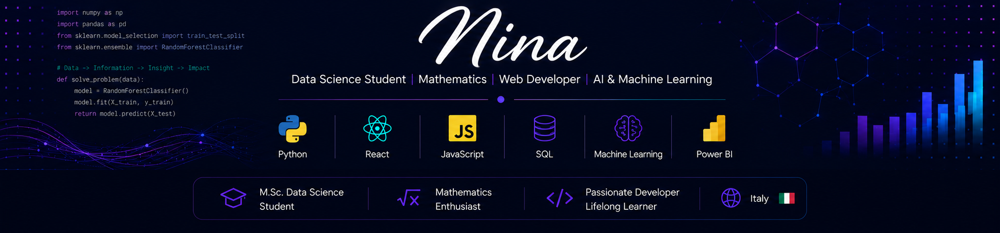

<p align="center">
  
</p>


# Hi, I'm Mina  👋

🎓 M.Sc. Student in Data Science at the University of Naples Federico II <br>
📐 Academic background in Mathematics, including an M.Sc. in Financial Mathematics and a B.Sc. in Mathematics <br>
🔥 Passionate about building data-driven and software solutions that solve real-world problems<br>
🔭 Currently looking for internship and junior opportunities in Data Science, AI, and Software Development<br>

I have academic backgrounds in Mathematics and Financial Mathematics, with hands-on experience in data science projects involving machine learning, computer vision, NLP, time series analysis, and web development.

## Technical Skills

**Programming Languages**
- Python
- JavaScript
- SQL
- R

**Web Development**
- React
- HTML
- CSS
- Node.js

**Data Science & AI**
- Machine Learning
- Natural Language Processing (NLP)
- Time Series Analysis
- Data Mining
- Statistical Analysis
- Generative AI

**Libraries & Tools**
- Pandas
- NumPy
- SciPy
- Scikit-learn
- OpenCV
- YOLOv8
- Apache Spark
- Power BI
- Matplotlib

**Databases**
- MySQL

**Development Tools**
- VS Code
- Netlify

**Other**
- Godot Engine (Game Development)

## Featured Data Science Projec

- 🩺 AIFA Medicine Data Engineering
- 🌏 Air Quality Forecasting With Dashboard
- 💧 Smart Water Management
- 🧠 Twitter Sentiment Analysis
- 🦴 Osteoporosis Risk Prediction
- 🐟 Aquarium Object Detection


## Featured Software Projects

-  🪙 Cryptocurrency Market Tracker
-  🎮 Games Library
-  🌦️ Weather App
-  🔠 Quiz App
-  🛍️ Mini Store App

## Projects Related to Mobile Development

-  📝 ToDo  App

## Currently Learning

- Advanced Machine Learning
- AI Applications
- Software Engineering
- Italian 🇮🇹

## Interests

- Artificial Intelligence
- Data Science
- Software Development
- Game Development
- Fitness
- Guitar
- Language Learning


## Languages

```text
Persian    🟪🟪🟪🟪🟪🟪
English    🟪🟪🟪🟪🟪⬜
Italian    🟪🟪🟪⬜⬜⬜
Turkish    🟪⬜⬜⬜⬜⬜
Japanese   🟪⬜⬜⬜⬜⬜
Norwegian  🟪⬜⬜⬜⬜⬜
```


## 📫 Connect with Me

✉️ mroostpoor@gmail.com

 https://www.linkedin.com/in/mina-roostapour-d/
  
